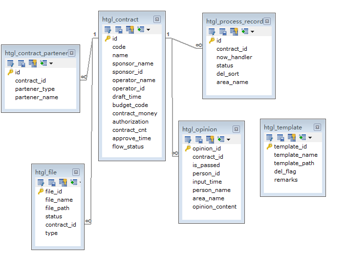

# mycontract
##### 一个关于合同管理的业务系统,包含了合同生命周期的相关管理。

系统PC端路径：http://localhost:8080/contract/loginPage

系统移动端路径：http://localhost:8080/contract/mobile/loginPage

## 使用到的技术

1. springboot

2. mybatisplus

3. thymeleaf

4. shiro

5. jackson

6. druid

7. mysql

   

## 系统功能列表

1. 首页
2. 合同起草
3. 合同审签
4. 合同签订
5. 合同模板管理
6. 用户管理
7. 角色管理
8. 菜单管理
9. 部门管理

## 合同管理总体流程

## 数据库设计

1.合同业务模块E-R图

2.权限管理模块E-R图

